# Ghidra Processor Specification - Quick(er) Start Guide #

## Table of Contents ##

- [Ghidra Processor Specification - Quick(er) Start Guide](#ghidra-processor-specification---quicker-start-guide)
  - [Table of Contents](#table-of-contents)
  - [Introduction](#introduction)
  - [Source Material](#source-material)
    - [Ghidra's website](#ghidras-website)
    - [Ghidra documentation](#ghidra-documentation)
    - [Other Tutorials](#other-tutorials)
  - [First Steps](#first-steps)
    - [Install Software](#install-software)
    - [Install Eclipse Plugins](#install-eclipse-plugins)
  - [Creating a GhidraDev Project](#creating-a-ghidradev-project)
  - [GhidraDev Project Tour](#ghidradev-project-tour)
    - [Default Package Content](#default-package-content)
    - [Debugging](#debugging)
    - [Primary Plugin classes](#primary-plugin-classes)
    - [Script folder](#script-folder)
    - [Data/Languages Folder](#datalanguages-folder)

## Introduction ##

This repo is meant to be used as a quick-start tutorial for specifying a new processor for [Ghidra](https://ghidra-sre.org/). Other tutorials are (in my opinion) lacking in detail, examples, screenshots, or just content in general. I will try to remedy some of this here.

## Source Material ##

In order write this guide, I referenced the following sources:

### [Ghidra's website](https://ghidra-sre.org/) ###

  1. [Ghidra installation guide](https://htmlpreview.github.io/?https://github.com/NationalSecurityAgency/ghidra/blob/stable/GhidraDocs/InstallationGuide.html)

  2. [Ghidra's GitHub](https://github.com/NationalSecurityAgency/ghidra)

  3. [Ghidra's developer guide](https://github.com/NationalSecurityAgency/ghidra/blob/master/DevGuide.md)

### [Ghidra documentation](https://ghidra.re/docs/) ###

  1. [Sleigh](https://ghidra.re/courses/languages/html/sleigh.html)

  2. [P-Code](https://ghidra.re/courses/languages/html/pcoderef.html)

### Other Tutorials ###

  1. [ghidra.re](https://ghidra.re/online-courses/)

  2. [spinsel.dev](https://spinsel.dev/2020/06/17/ghidra-brainfuck-processor-1.html)

  3. [swarm.ptsecurity.com](https://swarm.ptsecurity.com/creating-a-ghidra-processor-module-in-sleigh-using-v8-bytecode-as-an-example/)

## First Steps ##

### Install Software ###

1. Install a Ghidra-compatible [Java](https://docs.aws.amazon.com/corretto/latest/corretto-11-ug/downloads-list.html) version

2. Install [Ghidra](https://ghidra-sre.org/InstallationGuide.html)

3. Install [Eclipse](https://www.eclipse.org/downloads/)

### Install Eclipse Plugins ###

1. Launch Eclipse

2. Go to *Help->Install New Software...* \
  \
  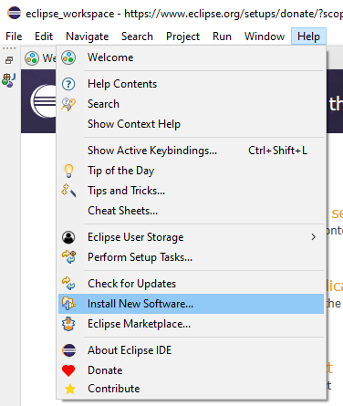

3. Select *Add...* then *Archive...* \
  \
  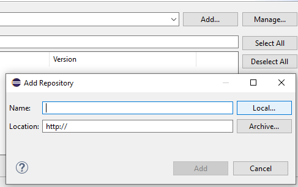

4. Navigate to `<GHIDRA_PATH>Extensions/Eclipse` where `<GHIDRA_PATH>` is the folder you unzipped Ghidra into. `<GHIDRA_PATH>` should look something like the following: \
  \
  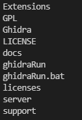

5. Install GhidraDev and Ghidra Sleigh Editor \
  \
  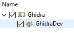 \
  \
  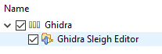

6. Restart, enable open ports \
  \
  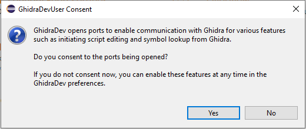

## Creating a GhidraDev Project ##

1. Go to *File->New->Project...* \
  \
  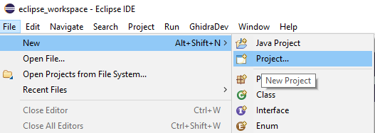

2. Select *Ghidra Module Project* \
  \
  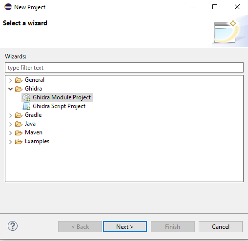

3. Keep all Ghidra options selected \
  \
  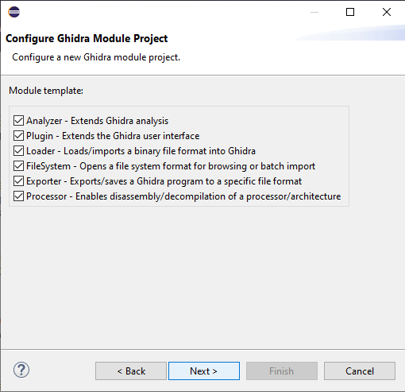

4. Add you Ghidra install location to the plugin. This is the same `<GHIDRA_PATH>` mentioned elsewhere in this readme. \
  \
  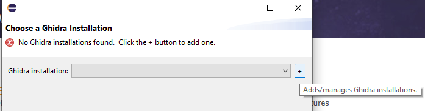

5. Let Eclipse finish creating the project

## GhidraDev Project Tour ##

### Default Package Content ##

- A new project should have the following folder structure \
  \
  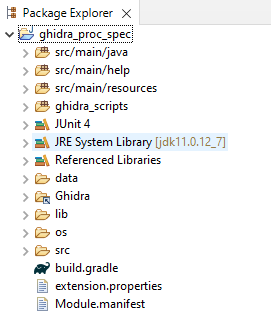

### Debugging ###

- Clicking the bug or using the debugging keyboard shortcut will let you run ghidra in debug mode and enable breakpoints. Just select your project for debugging and if you have pointed the GhidraDev plugin at your Ghidra folder it should launch Ghidra for you. \
  \
  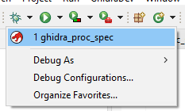

### Primary Plugin classes ###

  \
  &nbsp;&nbsp;&nbsp;&nbsp; 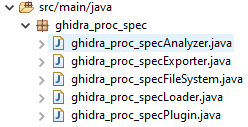

- `Analyzer` determines if/when your new code will run, then defines the main functionality.
- `Exporter` allows for exporting content from the binary
- `FileSystem` lets you define custom file system interaction
- `Loader` is where you define custom memory blocks and peripheral modules
- `Plugin` is where you define the plugin name and description and link up the other classes

### Script folder ###

 \
&nbsp;&nbsp;&nbsp;&nbsp; 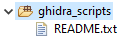

- You can add scripts to your plugin

  - Scripts are accessible through the script manager window in the code browser in Ghidra \
  \
  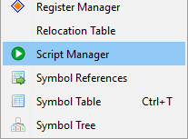

### Data/Languages Folder ###

  \
  &nbsp;&nbsp;&nbsp;&nbsp; 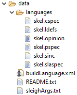

- File Types

  - `cspec` is the compiler specification. It lets you define default aspects of your processor your compiler will use.

  - `ldefs` is the initial language definition. It enables Ghidra to load your language specification.

  - `opinion` lets you specify optional logic for sub-processor families and behaviors.

  - `pspec` is the definition for default register values and specific register names for common processor functions (such as the program counter and stack pointer).

  - `sinc` is the 'header' file for sleigh language specification.

  - `slaspec` is the main specification file for the processor. This is where the memory, registers, opcodes, and opcode functionality are all defined (functionality can be split/moved into the 'sinc' file).

- `Building`

  You can build the processor specification by right-clicking the `BuildLanguage.xml` file and running 'Ant Build' \
  \
  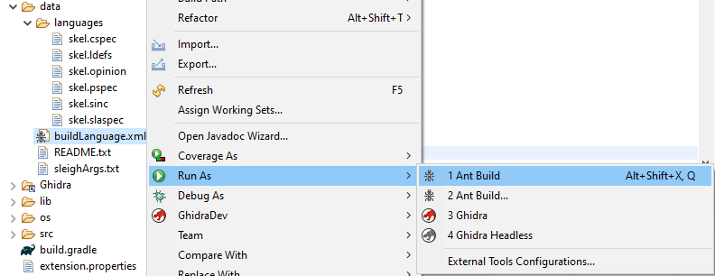

  This will provide you with error messages and line numbers while writing your processor specification

  - Successful build \
    \
    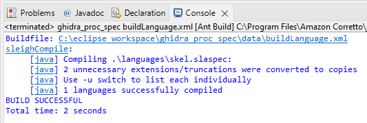

  - Failed build \
    \
    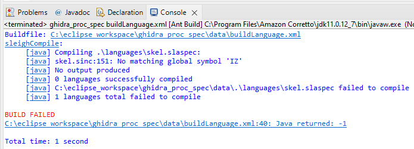

## First Steps in Processor Specification ##

### Research ###

The first step is to find all relevant manuals for the processor you will be defining.  You will need to know the register layout, memory layout, and instruction set. Then read all of it and probably take notes.

### The LDEFS file ###

The first place to start is the `*.ldefs` files. This is where you will make basic declarations about the architecture of your processor. This is also where you will have to start updating the default value of `skel` to your chosen processor.

See `<GHIDRA_PATH>/Ghidra/Framework/SoftwareModeling/data/languages/language_definitions.rxg` for the XML schema.

- `EggSample.ldefs`

  ```html
  <language processor="EggSample"
          endian="little"
          size="8"
          variant="default"
          version="1.0"
          slafile="EggSample.sla"
          processorspec="EggSample.pspec"
          id="EggSample:LE:8:default">
    <description>EggSample Language Module</description>
    <compiler name="default" spec="EggSample.cspec" id="default"/>
  </language>
  ```

  Most of this should make sense if you have read through your manuals. The EggSample processor is a very simple 8-bit processor with very few instructions or registers.

  - `language` is for describing the processor

    - `processor` is the name of your processor
    - `endian` is whether your processor uses big or little endianness
    - `size` is the number of bits your processor uses
    - `variant` is for defining which model in a family of processors this file is for
    - `version` is the version of the definition
    - `slafile` is the name of the `.sla` file in which the opcodes are defined
    - `processorspec` is the name of the `.pspec` file in which the processor details are defined
    - `id` is the unique identifier of this definition

  - `description` is the description printed for the user describing this processor

  - `compiler` is for describing the compiler

    - `name` is the compiler name
    - `spec` is the name of the `.cspec` file for this processor

### The PSPEC File ###

The `*.pspec` file is where you set up Ghidra's initial expectations about your processor. You define the names of the registers and can set of some pre-defined symbols as well.

See `<GHIDRA_PATH>/Ghidra/Framework/SoftwareModeling/data/languages/processor_spec.rxg` for the XML schema.

- `EggSample.pspec`

  ```html
  <processor_spec>
    <programcounter register="PC"/>
    <register_data>
      <register name="A"/>
      <register name="B"/>
    </register_data>
  </processor_spec>
  ```

  Only three registers are declared for this processor.

  - `processor_spec` is for specifying your processor details

    - `programcounter` is the name of the register that is used as the program counter
    - `register_data` is for defining registers

### The OPINION File ###

The `*.opinion` file is for providing guidance to the importer when Ghidra initially imports the binary.

- `EggSample.opinion`

  ```html
  <opinions>
  </opinions>
  ```

  This example will not use the opinion file.

### The CSPEC File ###

The `*.cspec` file is where you tell Ghidra how functions are called and specify stack interactions.

See `<GHIDRA_PATH>/Ghidra/Framework/SoftwareModeling/data/languages/compiler_spec.rxg` for the XML schema.

- `EggSample.cspec`

  ```html
  <compiler_spec>
    <data_organization>
      <pointer_size value="1" />
    </data_organization>
    <global>
      <range space="ram"/>
    </global>
    <stackpointer register="SP" space="ram"/>
  </compiler_spec>
  ```

  This file defines pointer size, which memory block (defined in `.sla` files) the pointers will point to, and what register is used as the stack pointer.

  - `compiler_spec` is where you specify compiler information

    - `data_organization` is where you specify how memory is addressed

      - `pointer_size` is the defined size of pointers for this processor

    - `global` is where global definitions are made

      - `range` is the definition of a memory block/space

    - `stackpointer` is the name of the register that will be used as the stack pointer

### The SLASPEC and SINC Files ###

These files are the meat of the processor specification. The `*.slaspec` can be thought of as the main source code, and the `*.sinc` is more of an include file. you can omit the `*.sinc` file and add it back in later when you are ready to organize.

- `EggSample.sinc`

  ```sleigh
  # nothing here
  ```

- `EggSample.slaspec`

  ```sleigh
  define endian=little;
  define alignment=1;

  define space ram type=ram_space size=1 default;
  define space register type=register_space size=1;

  define register offset=0x00 size=1 [ A B C D ];
  define register offset=0x10 size=1 [ PC SP FLAGS ];

  define token opbyte (8)
    op      = (0,5)
    op8     = (0,7)
    op_abcd = (6,7)
  ;

  define token data8 (8)
    imm8_u         = (0,7)
    imm8_s         = (0,7) signed
    imm8_sign_bit  = (7,7)
  ;

  :MOVAB is op8=0x40
  {
    A = B;
  }
  ```

  - `define endian` should be the first thing in the file, it defines the endianness

  - `define alignment` is the assumed byte alignment of instructions and addresses in this processor.

  - `define space` is how memory blocks are defined. Some names, such as `register_space` are special symbols which must match.

  - `define register` is how you define registers. Registers may be listed individually, or in a sequence where the `offset` for each listed register name will be incremented by `size`.

  - `define token` is how you define the bits, bytes, and words that make up an instruction's opcode. The bits and bytes within a token may overlap and be reused as necessary to allow decoding of the opcodes into instructions.

  - `:MOVAB is op8=0x40` is a single defined instruction whose opcode matches the whole eight bits of the hex value 0x40. Judging by the name and the operation defined inside the curly braces ("`A = B;`"), it appears that this instruction copies register B into register A.
